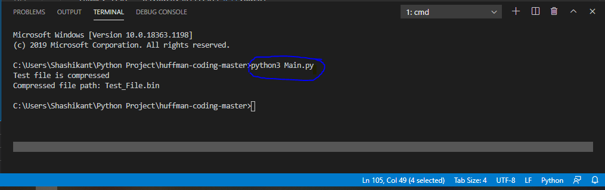
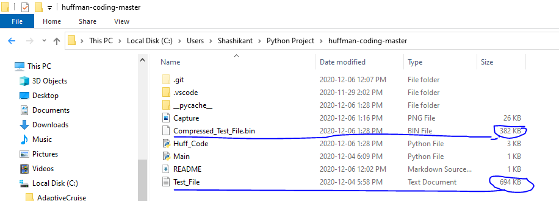

### Title: 
Python Implementaion of Huffman Coding for text file
### Description:
Huffman coding is used for lossless data compression. It means it will reduce the size of a file(Text or Image or Audio) without any changes to its data.
In our application we have use heap queue. In python it is implemented using the heapq module. It is very useful in implementing priority queues where the queue item with higher weight is given more priority in processing. This library has 4 functions in which we have used heappop function in our application. This function returns the smallest data element from the heap.

Another module which we have used in our application is the os module. In python this module provides functions for interacting with the operating system. OS, comes under Python’s standard utility modules.
### Project Setup:
This project is implemented in Visual Studio Code which has Python 3.7.9 64-bit extension.

#### Testing / Running the program

1. Save / Clone the above repository
2. The repository consists of a sample test file named "Test_File.txt" of size 694 KB
3. Run the python code `Main.py` to compress the given test file. For eg. open terminal and run `python3 Main.py`.

4. As you can see in the above image, the test file is compressed and the size of the new compressed file is nearly half the size of the original one. The compressed file will be present at the same location with the name "Compressed_Test_File.bin".

To run the code for compression of any other text file, edit the `path` variable in the `Main.py` file. 
